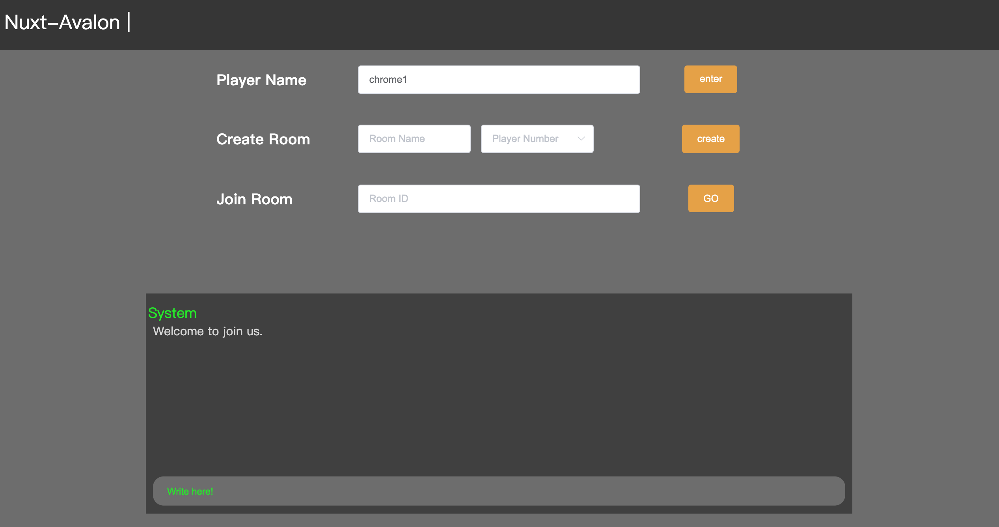
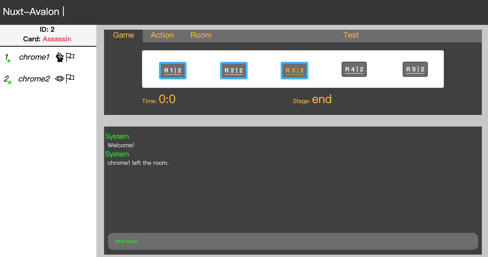
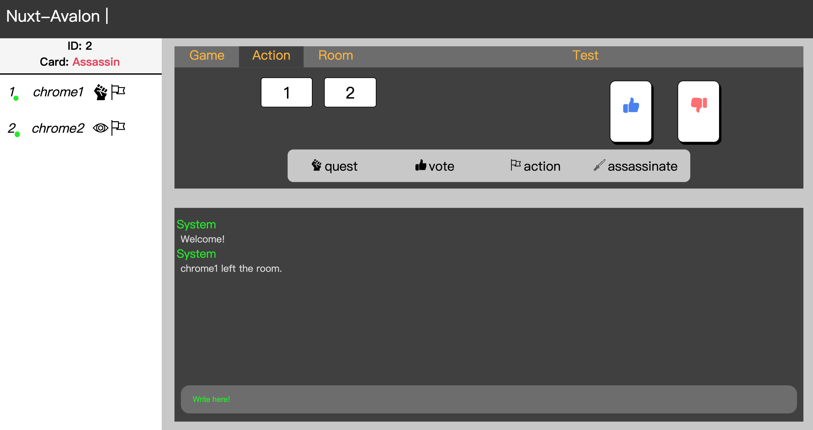

# Avalon

## Introduction

Author: James Huang

Avalon is a popular board game. All players are separated into two sides. Blue side represents loyal officials and Red side represents traitor.  Loyal officials need to work together to find out the traitors in the team.

---

## Structure

client: frontend interface built by nuxt.js

gameServer: socket game server using express.js

redis: save game data and user data

---

## Process

So far most parts of game server logic and interface are completed. It is available to play in 5~8 players mode.
The next stages are

    1. deploy on cloud server
    2. finish rest parts of client and gameServer
    3. transfer data and save on redis

## Snapshot

hall: Home page for users to input their username, create game room and joing game by room id.
 

game room: The page for playing avalon game. The game will start as long as there are enough players in the room.

---

## Game Rule

## action commands in game

    // vote Y or N - Vote for deciding whether mission is proceeding or not.
    // quest player id - Quest a player to join the mission.
    // action S or F - Make mission success or fail
    // assassinate player id - Assassinate the player whom you think is Merlin.
